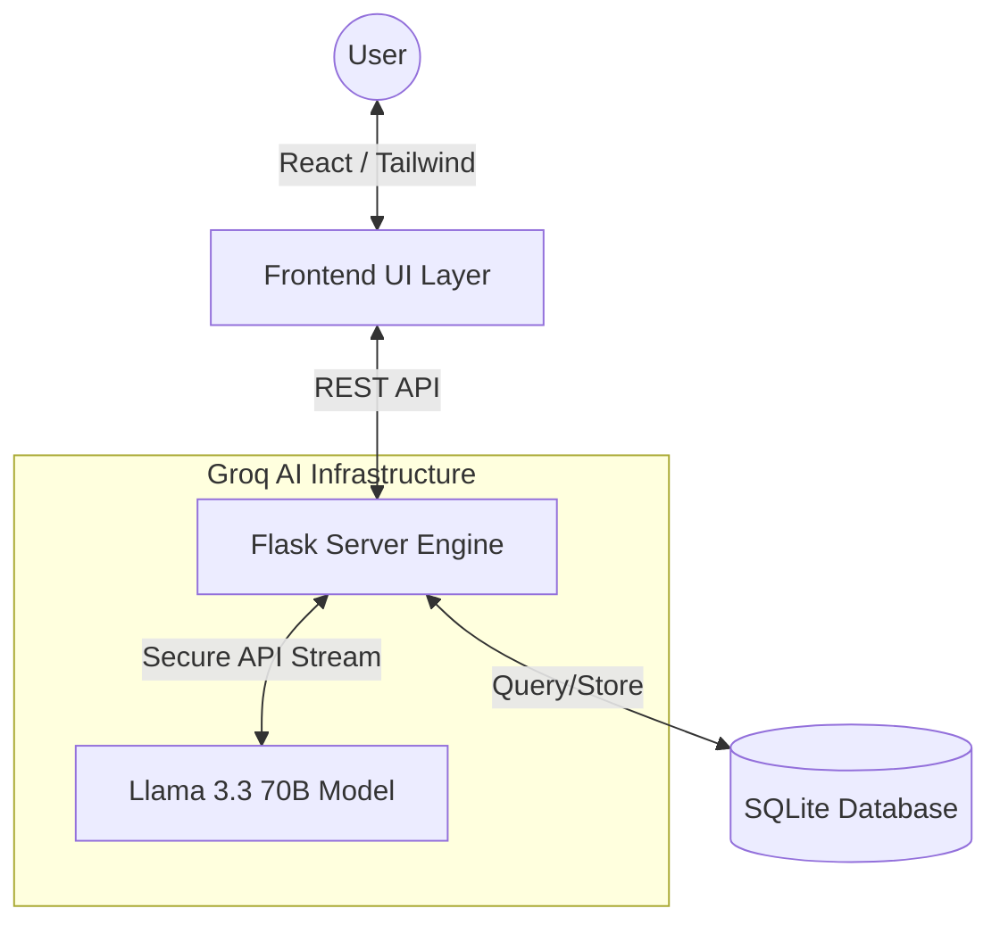
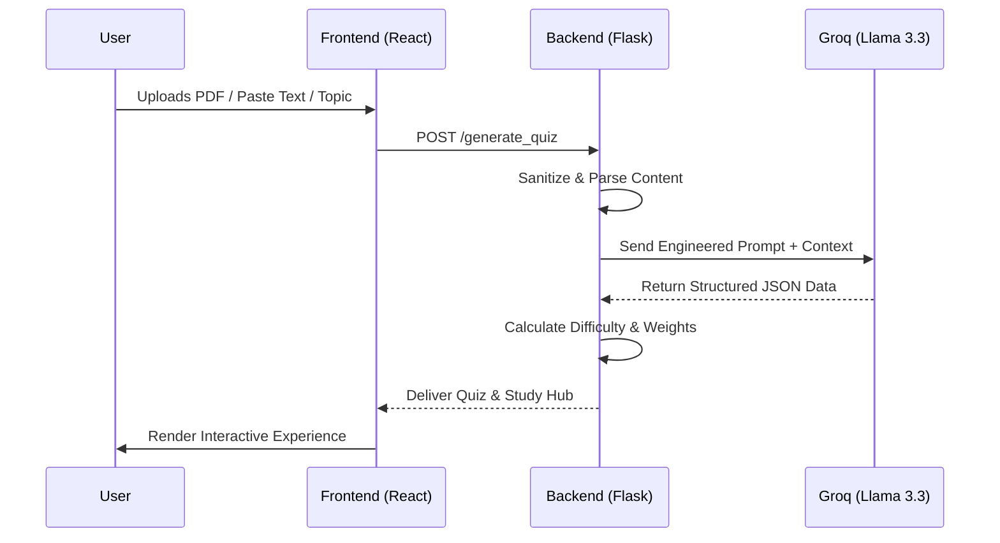
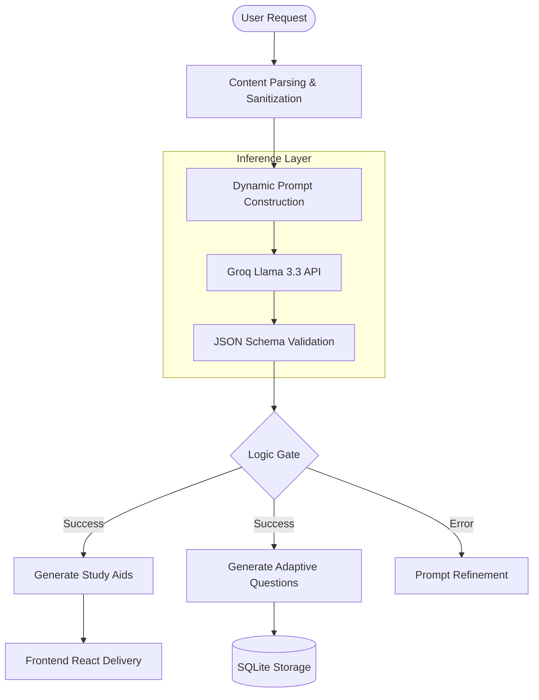
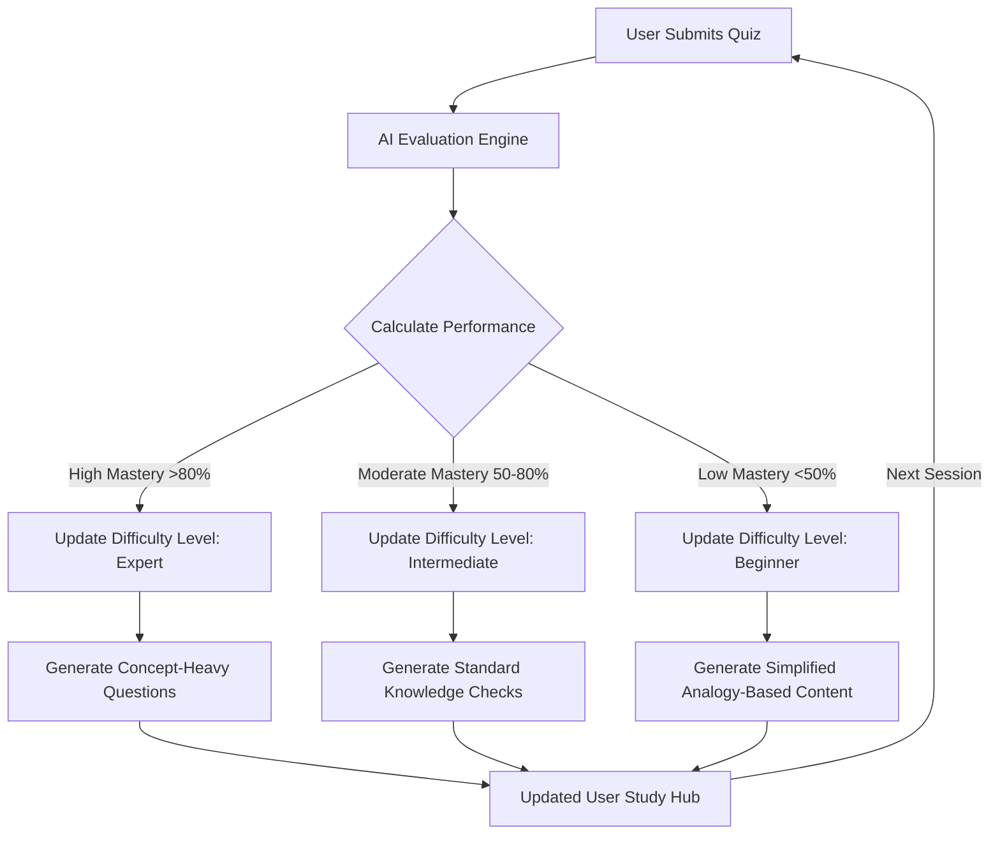

# SmartQuizzer 🚀 > (Font: Poppins Bold | Color: #FFB300 | Size: 60pt+)
## Elevating Raw Data into Cognitive Intelligence > (Font: Poppins | Color: #FFB300)

### **Powered By**
    

---

### 🔗 Live Demo
> **🌐 Visit App:** [https://smartquizzer.onrender.com](https://smartquizzer.onrender.com)

---


### 📑 Table of Contents

* [🧠 Overview](#-overview)
* [🎓 What Makes SmartQuizzer Different?](#-what-makes-smartquizzer-different)
* [🎯 Core Philosophy](#-core-philosophy)
* [✨ Key Features](#-key-features)
* [🚀 Core Capabilities](#-core-capabilities)
* [👥 Target Audience](#-target-audience)
* [💻 Technology Stack](#-technology-stack)
* [🏗️ System Architecture](#-system-architecture)
* [🧠 Adaptive Learning Engine](#-adaptive-learning-engine)
* [🔬 Difficulty Calculation & Feature Logic](#-difficulty-calculation--feature-logic)
* [🗺️ User Journey & Experience Map](#-user-journey--experience-map)
* [🖥️ Screen-by-Screen Breakdown](#-screen-by-screen-breakdown)
* [🏗️ Layout Component Architecture](#-layout-component-architecture)
* [📊 Result Screen & Analytics Breakdown](#-result-screen-breakdown)
* [🔬 AI Evaluation System](#-ai-evaluation-system)
* [💬 AI Feedback Generation System](#-ai-feedback-generation-system)
* [📊 Performance Tracking Dashboard](#-learning-analytics--performance-tracking)
* [💻 Developer's Portal](#-developers-portal)
* [🔮 Future Roadmap](#-future-roadmap-the-path-to-v30)
* [🤝 Contributing](#-contributing)
* [👥 Meet the Team](#-meet-the-team)
* [📜 License](#-license)

---

### 🧠 Overview
**SmartQuizzer** is an intelligent, AI-driven learning ecosystem designed to transform static educational content into dynamic, personalized assessments. It bridges the gap between passive reading and active recall by using **Llama 3.3 (Groq)** to generate contextual study materials and quizzes from any source—be it a topic, a document, or even an image.

---

### 🎓 What Makes SmartQuizzer Different?

| Feature | Traditional Platforms | 🚀 SmartQuizzer |
| :--- | :--- | :--- |
| **Content** | Pre-defined static question banks | Generated on-the-fly from any source |
| **Difficulty** | Static (Fixed levels) | **Adaptive** (Changes based on performance) |
| **Evaluation** | Exact string/keyword matching | **Semantic Understanding** (Meaning-based) |
| **Study Aids** | Generic summaries | Personalized Mnemonics & ELI10 Logic |

---

### 🎯 Core Philosophy
> *"Assessment shouldn't just measure learning—it should drive it."*

SmartQuizzer operates on three fundamental principles:
1. **🧠 Adaptive Intelligence:** Questions evolve in real-time based on user accuracy and response speed.
2. **💡 Semantic Understanding:** AI evaluates the logic and meaning behind answers, ensuring conceptual clarity.
3. **🎯 Targeted Growth:** Personalized feedback loops identify specific weaknesses to bridge conceptual gaps.

---

### ✨ Key Features

| 🛠️ Feature | 📝 Description |
| :--- | :--- |
| **🖼️ Image-to-Quiz** | Advanced OCR to convert handwritten notes or textbook photos into structured quizzes. |
| **⚡ AI Study Hub** | Includes Shorthand Notes, Mnemonics, and "Explain Like I'm 10" (ELI10) logic. |
| **📈 Adaptive Engine** | Weighted difficulty scaling that moves users from Beginner to Expert levels. |
| **🌐 Multi-Source** | Supports PDF uploads, URL imports, Topic entries, and Raw Text. |
| **📊 Smart Analytics** | Detailed performance tracking with topic mastery and growth radar charts. |
| **🧠 ELI10 Logic** | "Explain Like I'm 10" simplified analogies. | Breaks down complex jargon into layman's terms. |
| **📜 Mnemonic Generator** | AI-crafted memory stories & acronyms. | Boosts long-term retention of difficult facts. |
| **🔍 Expert OCR** | Context-aware Image Analysis. | Fixes typos and messy handwriting during extraction. |
| **📝 Interactive Notes** | Shorthand expandable bullet points. | Allows for rapid skimming with deep-dive options. |

---

## 🚀 Core Capabilities

| Capability | Technical Realization | Impact |
| :--- | :--- | :--- |
| **OCR & Vision** | Advanced Image Processing | Converts handwritten notes and physical textbooks into digital assessments. |
| **Contextual Parsing** | Llama 3.3 Large Language Model | Extracts core concepts from unstructured text with high accuracy. |
| **Adaptive Logic** | Dynamic Prompt Engineering | Adjusts question complexity based on real-time user performance. |
| **Semantic Scoring** | Meaning-based Analysis | Grades answers based on conceptual correctness rather than exact wording. |

---

## 👥 Target Audience

| User Group | Use Case | Primary Benefit |
| :--- | :--- | :--- |
| **🎓 Students** | Exam Preparation | Rapid revision via Mnemonics and active recall quizzes. |
| **👨‍🏫 Educators** | Material Generation | Reduces manual question-setting time by over 90%. |
| **💼 Professionals** | Skill Assessment | Quick validation of knowledge from technical whitepapers. |
| **🏢 Organizations** | Onboarding | Scalable way to test knowledge on internal manuals. |

---

## 💻 Technology Stack

| Layer | Technology | Purpose |
| :--- | :--- | :--- |
| **Frontend** |  | Building a responsive and dynamic User Interface. |
| **Styling** |  | Modern, glassmorphic, and mobile-first design. |
| **Backend** |  | Managing API routes and core application logic. |
| **AI Engine** |  | Ultra-fast Llama 3.3 inference for content generation. |
| **Database** |  | Lightweight relational database for local data persistence. |
| **Language** |  | Primary language for backend and AI orchestration. |

---
---

## 🏗️ System Architecture

SmartQuizzer follows a decoupled **Client-Server Architecture** optimized for high-speed AI inference and asynchronous data processing.

### 📐 High-Level Architecture
This diagram illustrates the macro-interaction between the User Interface, the Application Logic, and the External AI Inference Engine.


### 🔄 Request Flow Architecture
The step-by-step lifecycle of a single request, from user input to the final generated output.

### 🔄 Complete System FLow
The internal architectural logic showing how the Backend handles data, interacts with Llama 3.3, and manages the adaptive difficulty scaling.

---

### ⚙️ Quiz Generation Pipeline
The transformation of raw user data into a structured, intelligent learning assessment follows a 5-phase pipeline:

| 📍 Phase | 🏷️ Title | 🛠️ Technical Process | 📤 Output |
| :--- | :--- | :--- | :--- |
| **Phase 1** | **Ingestion** | Multi-format parsing (OCR for images, PDF extraction, and text sanitization) | **Normalized Raw Text** |
| **Phase 2** | **Contextualization** | Identifying key entities, technical terms, and core concepts via Llama 3.3 LLM | **Context Map** |
| **Phase 3** | **Logic Synthesis** | Applying Spaced Repetition and Active Recall logic to dynamic prompt engineering | **Raw AI Response** |
| **Phase 4** | **Validation** | Ensuring AI output matches the required JSON structure for UI rendering and error handling | **Validated Payload** |
| **Phase 5** | **Adaptive Delivery** | Calculating difficulty weights based on user's historical accuracy and response speed | **Live Assessment** |

---
---

## 🧠 Adaptive Learning Engine

The core strength of **SmartQuizzer** lies in its ability to analyze user performance in real-time and adjust the academic rigor accordingly.

### 🔧 How It's Enabled
The engine is triggered automatically upon user interaction. It utilizes a **Dynamic Feedback Loop** that monitors:
1. **Accuracy:** Correctness of the response.
2. **Contextual Depth:** The quality of theory answers (via Semantic Scoring).
3. **Historical Data:** Previous attempts stored in the local SQLite session.

### 🔢 Adaptation Algorithm
SmartQuizzer uses a **Weighted Difficulty Scaling (WDS)** algorithm to decide the next set of questions:

| Level | Performance Metric (Score) | Engine Response |
| :--- | :--- | :--- |
| **🚀 Level Up** | Score > 85% | Inject higher-order thinking questions & Expert terminology. |
| **🔄 Maintain** | 60% < Score < 85% | Focus on reinforcing current concepts with varied phrasing. |
| **📉 Bridge Gap** | Score < 60% | Simplify complexity, provide **ELI10** analogies, and offer lower-tier questions. |

---

### 🔄 Adaptive Flow Diagram
This flowchart illustrates how the system decides whether to challenge the user or simplify the material.


---

## 🔬 Difficulty Calculation & Feature Logic

SmartQuizzer doesn't just "guess" the difficulty; it uses a mathematical approach to determine the user's **Knowledge Coefficient ($K_c$)**.

### 📐 The Formula
The next difficulty level is calculated using the following weighted average formula:

$$D_{next} = \frac{(A \times W_a) + (S \times W_s) + (H \times W_h)}{\sum W}$$

**Where:**
* $A$: **Accuracy Score** (0.0 - 1.0)
* $S$: **Semantic Depth** (How well the theory answer matches the core concept)
* $H$: **Historical Mastery** (Past performance on this specific topic)
* $W$: **Weightage constants** assigned to each parameter.

---

### 🛠️ Adaptive Feature Integration
Our core features are directly tied to this calculation. Depending on the $D_{next}$ output, the system toggles specific AI modules:

| Feature | Trigger Logic | Implementation |
| :--- | :--- | :--- |
| **🧠 ELI10 Module** | Triggered when $K_c < 0.5$ | AI rewrites complex jargon into "Explain Like I'm 10" analogies to fix foundational gaps. |
| **📜 Mnemonic Hub** | High error rate in fact-retention | System generates custom acronyms and stories to aid memory palace techniques. |
| **🔍 Expert OCR** | Initial Ingestion Phase | Sanitizes handwritten or image-based text to ensure the AI has 100% clean context. |
| **📑 Shorthand Notes** | Post-Quiz Analysis | Generates "Quick-Ref" bullet points focused only on the questions the user got wrong. |

---

### ⚙️ Evaluation Weightage Matrix
When a user submits a theory-based answer, the **AI Evaluation Engine** applies the following weights to calculate the Semantic Depth ($S$):

| Criteria | Weight | Purpose |
| :--- | :--- | :--- |
| **Semantic Match** | `40%` | Ensures the core meaning is correct, even if wording differs. |
| **Keyword Density** | `25%` | Checks for essential technical or subject-specific terminology. |
| **Logical Flow** | `20%` | Validates the "Cause and Effect" structure of the answer. |
| **Completeness** | `15%` | Checks if all sub-parts of the question were addressed. |

---
---

## 🗺️ User Journey & Experience Map

SmartQuizzer is engineered to provide a frictionless path from raw information to total conceptual mastery.

### 🔄 The End-to-End Journey
The following map outlines the psychological and functional stages a user experiences:

| Stage | User Goal | System Touchpoint | Emotional State |
| :--- | :--- | :--- | :--- |
| **1. Discovery** | Find a faster way to study | Landing Page (Value Prop) | 😟 Overwhelmed |
| **2. Entry** | Access the ecosystem | Onboarding / Quick Login | 🧐 Curious |
| **3. Ingestion** | Upload study material | PDF/Image/Text Input | 📤 Hopeful |
| **4. Processing** | Wait for AI results | Contextual AI Pipeline | ⏳ Anticipating |
| **5. Absorption** | Review simplified notes | AI Study Hub (ELI10/Mnemonics) | 💡 Enlightened |
| **6. Validation** | Test knowledge depth | Adaptive Quiz Engine | 🎯 Confident |
| **7. Retention** | Review progress | Analytics Dashboard | ✅ Satisfied |

---

## 🖥️ Screen-by-Screen Breakdown

Our interface is built on a **Glassmorphic Design System** to ensure high readability and a modern aesthetic.

| Screen Name | Core Functionality | Key UI Elements |
| :--- | :--- | :--- |
| **🏠 Landing Page** | Introduce value & conversion | Hero Section, Feature Cards, Live Demo CTA |
| **👋 Onboarding** | Personalize user experience | Expertise Selector, Goal Tags, UI Theme Toggle |
| **➕ Create Hub** | Central input for materials | Drag-and-Drop Area, OCR Camera, URL Parser |
| **⚡ AI Study Hub** | Interactive learning aids | ELI10 Toggle, Mnemonic Cards, Shorthand Notes |
| **📝 Quiz Arena** | Real-time assessment | Adaptive Questioning, Timer, Feedback Modal |
| **📊 Analytics** | Performance visualization | Radar Charts, Mastery Score, Topic History |

---

## 🚀 Landing Screen (Current Implementation)

The landing page focuses on **"Time-to-Value,"** ensuring users understand the app's power within seconds.

| Section | Content / Feature | Strategic Purpose |
| :--- | :--- | :--- |
| **Hero Area** | "Your AI Study Partner" Headline | Instant communication of the primary benefit. |
| **Feature Grid** | Image-to-Quiz, Adaptive Engine, ELI10 | Highlights the technical USP of the platform. |
| **Tech Stack Bar** | Logos (React, Python, Groq, SQLite) | Establishes technical authority and trust. |
| **Social Proof** | "Join 100+ Learners" | Uses community numbers to drive user conversion. |
| **Primary CTA** | "Start Learning for Free" | Frictionless entry point into the application. |

---

## 🏁 Onboarding Screen (Step-by-Step)

The onboarding flow calibrates the **Adaptive Engine** before the first quiz begins.

| Interface Element | User Input | Engine Calibration |
| :--- | :--- | :--- |
| **Profile Setup** | Name & Profile Picture | Personalized greetings and dashboard metadata. |
| **Expertise Level** | Beginner / Pro / Expert | Sets the initial $D_{start}$ (Initial Difficulty). |
| **Goal Selection** | Academic / Professional / General | Prioritizes either ELI10 (concepts) or Shorthand (facts). |
| **UI Configuration** | Dark Mode / Light Mode | Adjusts visual accessibility for long study sessions. |
| **Guided Tour** | Interactive Tooltips | Reduces the learning curve for advanced AI features. |

---
---

## ⚙️ Quiz & Library Screen Breakdown

### 🛠️ Quiz Configuration Screen
Before an assessment begins, this screen allows users to "fine-tune" the AI generation parameters.

| Feature | Control Type | Logic / Impact |
| :--- | :--- | :--- |
| **Question Count** | Slider (5 - 30) | Determines the depth of the assessment session. |
| **Focus Mode** | Toggle (Theory vs. MCQs) | Switches the **AI Pipeline** between retrieval and reasoning. |
| **Difficulty Override** | Select (Auto / Static) | Manual bypass of the **Adaptive Engine** for specific training. |
| **Time Constraint** | Timer Input | Adds "Pressure Testing" to the user performance metrics. |

---

### 📝 Quiz Interface Screen
The active testing environment where the **Adaptive Learning Engine** operates in real-time.

| Element | Component Type | Functionality |
| :--- | :--- | :--- |
| **Dynamic Question** | Text Block | High-fidelity questions generated based on current mastery. |
| **Semantic Input** | Rich Text Area | Captures theory answers for **Semantic Scoring (40/25/20/15)**. |
| **Instant Feedback** | Toast/Modal | AI explains *why* an answer was correct or incorrect immediately. |
| **Persistence Bar** | Progress Tracker | Visualizes how many questions remain in the current batch. |
| **AI Hint System** | "Nudge" Button | Provides a context-aware clue without giving away the answer. |

---

### 📚 Library Screen (User Workspace)
The central repository where all processed materials and past performances are archived.

| Section | Content Display | Management Actions |
| :--- | :--- | :--- |
| **Saved Modules** | Card Grid View | Re-take quizzes, edit source text, or delete modules. |
| **Mastery Badges** | Icon Achievements | Visual representation of topics where user scored >90%. |
| **Search & Filter** | Search Bar | Quickly locate specific PDF or Image uploads via metadata. |
| **Export Portal** | Button | Download study notes or performance reports as PDFs. |

---

### ⚡ AI Study Hub Screen
The most advanced section of the app, focusing on passive learning and memory encoding.

| Learning Aid | UI Implementation | AI Logic |
| :--- | :--- | :--- |
| **Shorthand Notes** | Expandable Accordion | Condenses context into 20% of its original length. |
| **Mnemonic Cards** | Flip-Cards | Creates "Memory Hooks" using acronyms and stories. |
| **ELI10 Logic** | "Simplify" Slider | Real-time rewriting of jargon into kindergarten-level logic. |
| **Concept Map** | Node Graph | Visualizes how different terms within the text are linked. |
| **Voice Narration** | Audio Player | TTS (Text-to-Speech) for auditory revision sessions. |

---
---

## 🏗️ Layout Component Architecture

The SmartQuizzer UI is built on a modular layout system. This ensures that the navigation and core structure remain persistent while the content dynamically updates based on the AI's output.

| Component | UI Role | Functionality & Logic |
| :--- | :--- | :--- |
| **Navbar** | Header Navigation | Contains the User Profile, Credits/Tokens display, and Global Search. |
| **Sidebar** | Navigation Rail | Provides quick access to the Library, Dashboard, and AI Settings. |
| **Main Content** | Viewport Wrapper | A glassmorphic container that renders the active route (Quiz, Hub, or Stats). |
| **Glass Card** | UI Primitive | A reusable wrapper with `backdrop-filter: blur()` used for all content blocks. |
| **Action Bar** | Contextual Footer | Floating controls for "Next Question," "Generate Notes," or "Save to Library." |
| **Status Overlay** | Feedback Layer | Displays AI "thinking" animations, loading skeletons, and success toasts. |

---

### 🎨 Visual Hierarchy Breakdown
Our layout follows a **Depth-First** design principle to keep the user focused on learning:

1. **Layer 0 (Background):** Animated mesh gradients (subtle motion).
2. **Layer 1 (Layout):** The Sidebar and Navbar (fixed position).
3. **Layer 2 (Content):** Dynamic cards and interactive study elements.
4. **Layer 3 (Modals):** Quiz results, AI explanations, and settings overlays.

---
---

## 📊 Result Screen Breakdown

The Result Screen serves as the "Post-Mortem" for the learning session, transforming quiz data into a visual mastery report.

| Component | Technical Implementation | Purpose & User Impact |
| :--- | :--- | :--- |
| **🏆 Performance Summary** | Circular Progress / Percentage | Provides an immediate high-level overview of the session score. |
| **🕸️ Mastery Radar Chart** | Chart.js / Recharts Integration | Visualizes performance across different sub-topics (e.g., Definitions vs. Logic). |
| **📝 Semantic Feedback** | AI-Generated Text Blocks | Explains *why* the user received their score based on the 40/25/20/15 logic. |
| **💡 Gap Analysis** | "Needs Review" List | Automatically highlights specific concepts the user struggled with during the quiz. |
| **🚀 Growth Metric** | Delta ($\Delta$) Comparison | Shows improvement or decline compared to the user's previous session on this topic. |
| **🔄 Quick Action Bar** | CTA Buttons | "Re-take Quiz," "Generate New Study Hub," or "Share Report." |

---

### 📈 Learning Analytics Logic
The data displayed on this screen is derived from the following post-quiz calculation:

| Metric | Logic | Insight Provided |
| :--- | :--- | :--- |
| **Retention Rate** | Correct Answers / Total Questions | Measures immediate recall capability. |
| **Conceptual Depth** | Average Semantic Score ($S$) | Measures how well the user understands the "Why" behind facts. |
| **Efficiency Score** | Accuracy / Time Taken | Identifies if the user is struggling with time pressure or second-guessing. |

---
---

## 🔬 AI Evaluation System

The evaluation engine utilizes a **Semantic Grading Logic** powered by Llama 3.3. Instead of looking for exact word matches, the system evaluates the **conceptual integrity** of the user's response.

### 🔄 Evaluation Process Flow
The grading lifecycle follows a rigorous four-step validation process:

1. **Extraction:** The system identifies core "Knowledge Nodes" within the correct answer.
2. **Comparison:** The user’s input is vectorized and compared against the Knowledge Nodes.
3. **Deduction:** Points are deducted for logical fallacies, contradictions, or missing dependencies.
4. **Synthesis:** A final weighted score is generated along with constructive, actionable feedback.

---

### 📏 Evaluation Criteria Matrix
The following matrix defines the weightage assigned to different aspects of a user's answer.

| Criteria | Weight | Technical Definition | Failure Trigger |
| :--- | :--- | :--- | :--- |
| **Semantic Match** | `40%` | Measures the alignment of the core meaning/concept. | Using correct words but in a logically incorrect order. |
| **Keyword Density** | `25%` | Presence of essential technical terms and nomenclature. | Using overly vague language or "layman" filler words. |
| **Logical Flow** | `20%` | Validates the "Cause & Effect" or sequential reasoning. | Skipping critical steps in a process or methodology. |
| **Completeness** | `15%` | Checks if all sub-parts of the prompt were addressed. | Providing a correct but "partial" answer to a multi-part question. |

---

### 💹 Scoring Tier Logic
Based on the final weighted percentage, the AI assigns a mastery level:

| Score Range | Mastery Tier | System Action |
| :--- | :--- | :--- |
| **90% - 100%** | 🏆 **Expert** | Confirms mastery; unlocks advanced "Deep Dive" topics. |
| **70% - 89%** | 🥈 **Proficient** | Identifies minor gaps; suggests specific "Shorthand" review. |
| **50% - 69%** | 🥉 **Intermediate** | Triggers **Mnemonic Generation** to assist with retention. |
| **< 50%** | ⚠️ **Beginner** | Forces **ELI10 Mode** to rebuild foundational understanding. |

---
---

## 💬 AI Feedback Generation System

SmartQuizzer doesn't just grade; it instructs. Our feedback system acts as a virtual tutor, translating raw scores into actionable study advice to ensure every mistake becomes a learning opportunity.

### 🔄 Feedback Generation Pipeline
The AI analyzes the "gap" between the user's input and the source content using a three-step cognitive check:

1. **Gap Identification:** AI compares the user's response vectors against the "Ideal Knowledge Nodes" extracted during ingestion.
2. **Contextual Framing:** The feedback is framed using **Scaffolding Theory**—providing enough hints to help the user find the answer without giving it away immediately.
3. **Actionable Redirection:** Every response concludes with a specific "Next Step" (e.g., "Review Mnemonic #3" or "Switch to ELI10 Mode").

---

### 📋 Feedback Criteria & Tier Logic
The feedback style dynamically shifts based on the **Semantic Score** calculated by the evaluation engine:

| Score Tier | Feedback Mode | Content Strategy | Example AI Response |
| :--- | :--- | :--- | :--- |
| **90-100%** | 🌟 **Reinforcement** | Confirms mastery and introduces an advanced "Expert Fact." | *"Spot on! You've mastered the core logic. Did you know this also connects to [Advanced Concept]?"* |
| **70-89%** | 💡 **Refinement** | Validates the logic but corrects specific technical terminology. | *"Your logic is sound, but try using the term 'Isothermal' instead of 'Steady Heat' for better precision."* |
| **50-69%** | 🔍 **Correction** | Identifies the specific logical "missing link" or dependency. | *"You understood the 'What' but missed the 'Why'. Re-read the 2nd paragraph of your Shorthand Notes."* |
| **< 50%** | ⚠️ **Redirection** | Breaks the concept down into an **ELI10** analogy immediately. | *"Let's simplify: Think of a CPU like a chef in a kitchen. You're missing how the 'Orders' (Data) are stored."* |

---

### 🛠️ Feedback UI Components
The user interacts with this feedback through three primary touchpoints:

* **Real-time Toasts:** Instant "Correct/Incorrect" indicators with brief logic snippets.
* **"Deconstruct My Answer" Button:** An optional deep-dive modal that explains the **Semantic Matrix (40/25/20/15)** scoring for that specific question.
* **Study Path Suggestions:** Found on the **Result Screen**, these are deep-links that take the user back to the specific part of the **Study Hub** they struggled with.

---
---

## 📊 Learning Analytics & Performance Tracking

The Dashboard is the "Command Center" for the learner. It moves beyond simple percentages to provide a high-resolution view of cognitive growth over time.

### 🕸️ Multi-Dimensional Mastery Radar
The core of our tracking is the **Mastery Radar Chart**. This provides a 360-degree view of the user's academic profile.


| Axis | Metric | Data Source |
| :--- | :--- | :--- |
| **Recall** | Fact Retention | Performance on Mnemonic-based questions. |
| **Logic** | Conceptual Linkage | Semantic scores on "Explain the process" questions. |
| **Speed** | Cognitive Fluency | Average response time vs. global complexity average. |
| **Precision** | Accuracy | Ratio of correct vs. incorrect attempts in MCQs. |
| **Application** | Scenario Solving | Success rate on "What if" or problem-solving prompts. |

---

### 📈 Performance Tracking Metrics
We track three specific "Success Signals" to help users identify their optimal study patterns:

| Success Signal | Technical Logic | User Insight |
| :--- | :--- | :--- |
| **Knowledge Velocity** | $\frac{\Delta Mastery}{\Delta Time}$ | Shows how fast the user is learning new topics. |
| **Retention Decay** | Ebbinghaus Curve Analysis | Predicts when a user will forget a topic and suggests a "Refresh Quiz." |
| **Complexity Ceiling** | Max $D_{next}$ achieved | Identifies the highest difficulty level the user can handle consistently. |

---

### 🧪 Visualizing the Learning Curve
The dashboard includes a **Chronological Learning Curve** that plots the user's progress across multiple sessions.


1. **The Climb:** Shows rapid gain during initial ingestion and ELI10 review.
2. **The Plateau:** Identifies "Hard Concepts" where the score remains static.
3. **The Mastery:** Visualizes the point where the user consistently hits >90% on Expert level questions.

---

### 📂 Historical Archive & Session Reports
Every study session generates a **Session Fingerprint** stored in the SQLite database:
* **Topic Tags:** Automatically generated by AI to categorize the study material.
* **Top Struggles:** A "Heatmap" of keywords the user consistently missed.
* **Study Time:** Total active engagement time (excluding idle periods).

---
---

## 💻 Developer's Portal

This section provides the technical roadmap for setting up a local development environment for SmartQuizzer.

### 📋 Prerequisites
* **Python 3.9+**: For the Flask backend and AI orchestration.
* **Node.js 18+**: For the React frontend.
* **Groq API Key**: Obtainable from the [Groq Cloud Console](https://console.groq.com/).
* **Tesseract OCR**: Required if testing the Image-to-Quiz functionality locally.

### 🛠️ Installation & Setup

1. **Clone the Project**
   ```bash
   git clone https://github.com/Simrannnnnnnnnnnn/SmartQuizzer.git (https://github.com/Simrannnnnnnnnnnn/SmartQuizzer.git)
   cd smartquizzer
   
2. **Backend Configuration (Flask)**
   ```bash
   cd backend
   python -m venv venv
   # Mac/Linux source venv/bin/activate
   # Windows: venv\Scripts\activate
   pip install -r requirements.txt
   
3. **Environment Variables Create a .env file in the /backend directory:**
   ```bash
   GROQ_API_KEY=your_groq_api_key_here
   FLASK_ENV=development
   DATABASE_URL=sqlite:///smartquizzer.db

4. **Frontend Configuration (React)**
   ```bash
   cd ../frontend
   npm install

5. **🚀 Launching the App
Start the Flask Server:**
```bash
# From /backend
python app.py
```
6. **Start The react app**
```bash
# From /frontend
npm start
```
---

## 🔮 Future Roadmap: The Path to v3.0

SmartQuizzer is evolving from a quiz generator into a fully autonomous AI tutor. Below are the key milestones in our development pipeline:

### 🛠️ Phase 1: Enhanced Interactivity (Short-term)
- [ ] **Voice Hub v2:** Integration with Whisper and TTS (Text-to-Speech) for hands-free "Viva-style" verbal examinations.
- [ ] **Collaborative Hubs:** Allow multiple users to join a "Study Room" and compete on the same AI-generated material in real-time.
- [ ] **PDF Export Portal:** One-click generation of beautifully formatted PDF study guides containing your personalized Mnemonics and Shorthand notes.

### 🧠 Phase 2: Cognitive Deepening (Mid-term)
- [ ] **Spaced Repetition System (SRS):** An automated notification system that prompts users to re-take quizzes exactly when the **Retention Decay** logic predicts they are about to forget.
- [ ] **Browser Extension:** A "Smart-Highlight" tool to generate instant 5-question quizzes from any technical article or documentation page while browsing.
- [ ] **Multi-Modal Mastery:** Support for video-link ingestion—convert YouTube educational videos into interactive assessments.

### 📊 Phase 3: Advanced Analytics (Long-term)
- [ ] **Global Benchmarking:** Anonymous data comparison to show how your **Knowledge Velocity** compares to the global average for specific topics.
- [ ] **Predictive AI:** Based on your historical "Gap Analysis," the AI will predict which topics you are likely to struggle with in future related modules.
- [ ] **Teacher Dashboard:** A specialized interface for educators to track the "Classroom Heatmap" and identify collective knowledge gaps in a group of students.

---

## 🤝 Contributing

Contributions are what make the open-source community such an amazing place to learn, inspire, and create. Any contributions you make are **greatly appreciated**.

1. Fork the Project
2. Create your Feature Branch (`git checkout -b feature/AmazingFeature`)
3. Commit your Changes (`git commit -m 'Add some AmazingFeature'`)
4. Push to the Branch (`git push origin feature/AmazingFeature`)
5. Open a Pull Request

---

---

## 👥 Meet the Team

SmartQuizzer was developed by a specialized 7-member team. The project was executed under the leadership of **Simran Kaur**, who managed the end-to-end development lifecycle, architectural vision, and team orchestration.

| Name | Role | Core Contributions |
| :--- | :--- | :--- |
| **Simran Kaur** |  **Project Lead** | Technical Strategy, Architectural Oversight, and Project Management.|
| **Pradhicksha** | **Systems Architect** | Core System Design and Integration Logic. |
| **Akash R** | **AI Logic Engineer** | Llama 3.3 Prompt Engineering and Adaptive Scaling. |
| **Riddhi** | **UI/UX Specialist** | Frontend Development and Glassmorphic Interface Design. |
| **Gopika** | **Backend Developer** | Flask API Infrastructure and Server-side Logic. |
| **Ankita Kumari** | **Data Architect** | Scoring Matrix Implementation and Database Management. |
| **Revathi Chavala** | **Vision Specialist** | OCR Pipeline and Image-to-Quiz Contextual Parsing. |

---

### 📩 Contact & Leadership
For inquiries regarding the technical roadmap or institutional collaboration, please reach out to the Project Lead:
* **Lead:** Simran Kaur 
---
